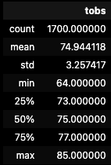
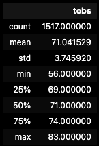

# surfs_up challenge

## Overview

The purpose of this analysis is to compare the temperature data on Oahu between June and December. This information will inform the timing of a client's decision to open a surf and ice cream shop. The analysis was done using a sqlite database of weather patterns as a resource and the numpy and pandas Python libraries as analysis tools.

## Results

These are the descriptive statistics for June and December, respectively.

### June Results

### December Results

### Key Differences

1. The mean temperature in June is 74.9 and the mean temperature in Demeber is 71.0, making for a difference of nearly 4 degrees Fahrenheit. Although the December temperature is lower on average, the tropical climate is relatively stable compared to other parts of the world.

2. The minimum temperature in June is 64 degrees Fahrenheit, and the minimum temperature in December is 56 degrees Fahrenheit, making for a difference of 8 degrees Fahrenheit.

3. The maximum temperature in June is 85 and the maximum temperature in December is 83, making for a difference of 2 degrees Fahrenheit.

## Summary

The differences in temperature between June and December are relatively small compared to other parts of the world. The mean and maximum temperatures are similar and can be considered ideal temperature conditions for surfing and frozen treats. Because of the minimum temperatures in both June and December, the shop is the least likely to receive business on the coldest days of either season, especially in December. However, out of conjecture I would say that the shop would still receive some business even on the cold days. Based on temperature data alone, I would predict that a shop with surf equipment and frozen treats would be successful both in June and December.

Data other than temperature data alone would help to inform this prediction. I would perform additional queries to gather a description of the precipitation data for both June and December. These queries can shed light on other weather factors that could possibly affect the attraction to the shop. This data would help to inform a decision to open the shop.
